# vladislav_tarasevich_homework
## Task 1
1. Setup apache2 web server VM with mod_jk module.
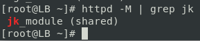
2. Setup 3 VMs with tomcat server and configure them. Tomcat instances surname-tomcat1, surname-tomcat2, surname-tomcat3
3. Add test.jsp from presentation to all tomcat servers.
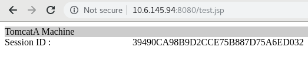
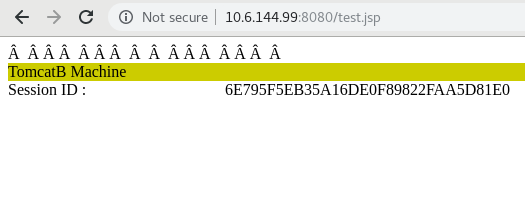
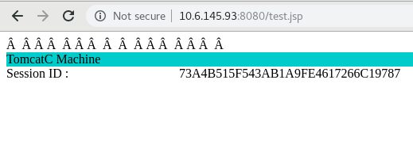
4. Deploy clusterjsp.war on each tomcat:
Autodeploy on surname-tomcat1
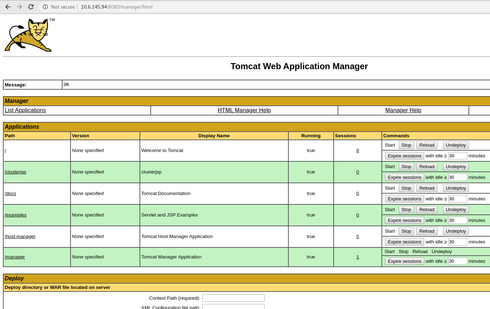
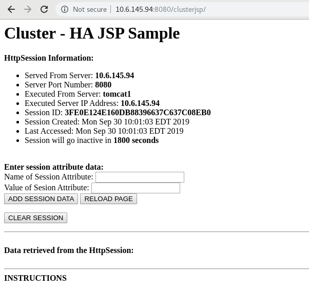
Deploy via browse local host on surname-tomcat2
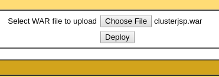
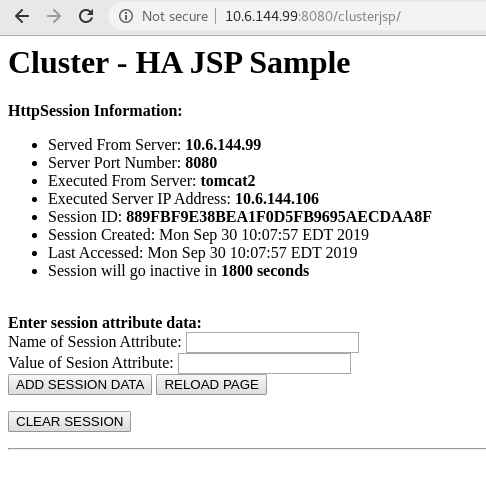
Deploy via ContextPath on surname-tomcat3
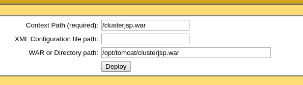
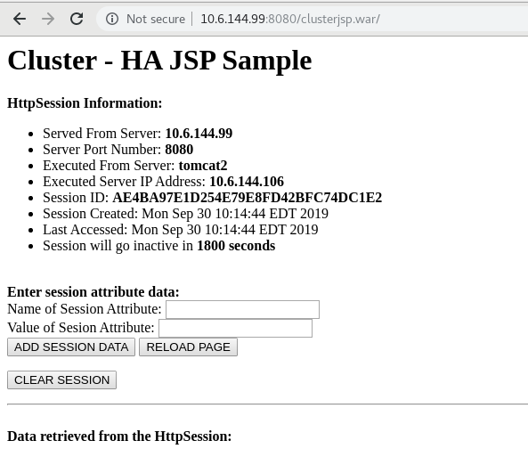
##Task2
1. Using mod_jk configure Tomcat Cluster with session persistence (replication):
a. Configure 4 separate Virtual hosts for surname-tomcat1.lab, surname-tomcat2.lab, surname-tomcat3.lab and Tomcat Cluster - surname-cluster.lab.
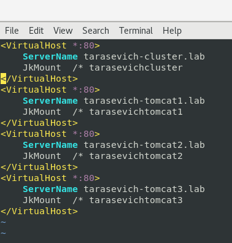
b. Configure mod_jk – worker.properties
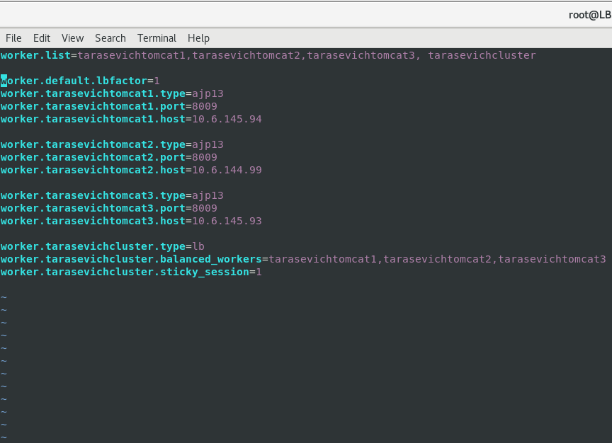
c. Setup cluster and check that you can reach clusterjsp app via surname-cluster.lab.
d. Check session persistence by stopping active tomcat server.
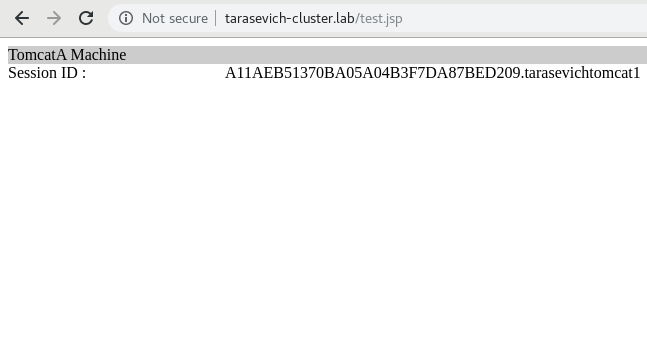
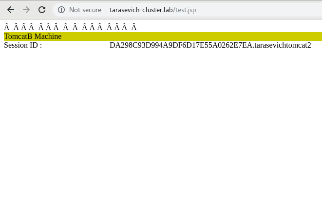
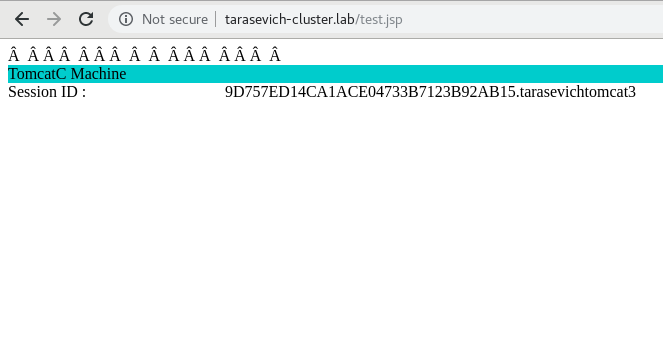
##Task3
1. Configure Log4j2 logging for one of the tomcat servers.
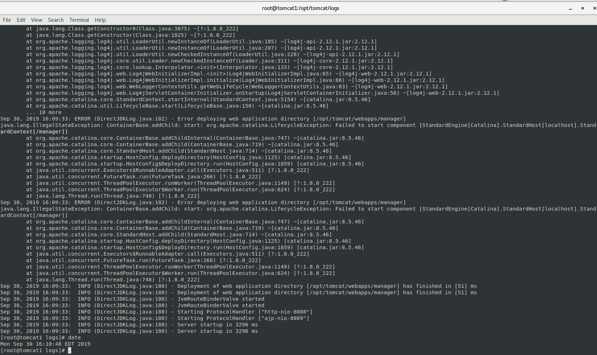
