# vladislav_tarasevich_homework
## Task 1
1. Configure hybrid multi-process multi-threaded httpd server (i.e., worker). Set server fqdn to worker.name.surname
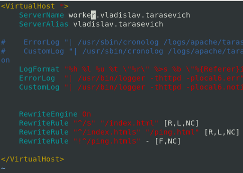
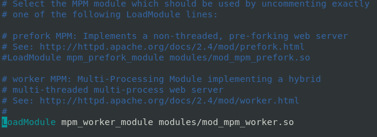
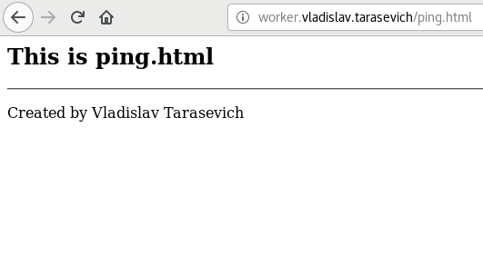
2. Set MaxRequestWorkers to 50. If necessary, change other module settings accordingly and start httpd server.
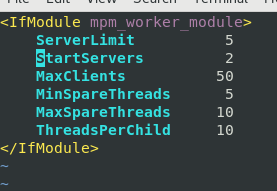
3. Show that httpd is using worker module.
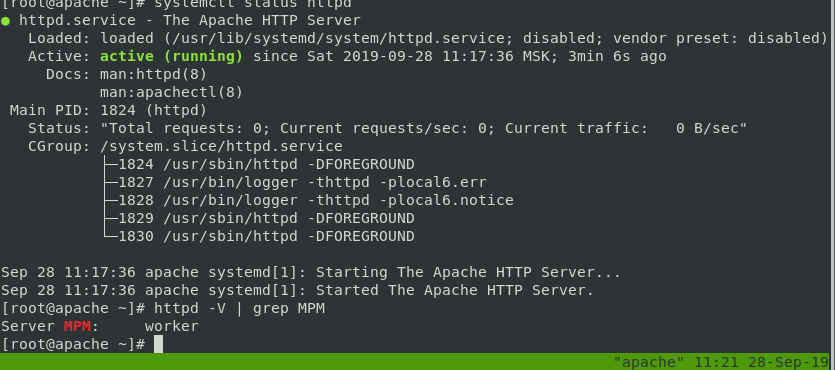
4. Using ab benchmarking tool prove that server can process only 50 simultaneous requests.

5. Show process tree, which includes workers and threads.
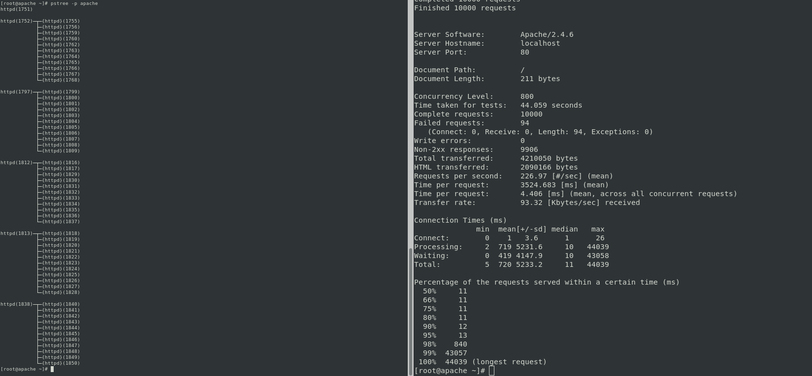
6. Stop httpd server and configure non-threaded httpd server (i.e., prefork). Set server fqdn to prefork.name.surname
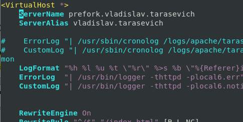
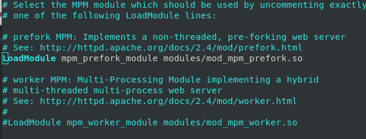
7. Set MaxRequestWorkers to 25. If necessary, change other module settings accordingly and start httpd server.
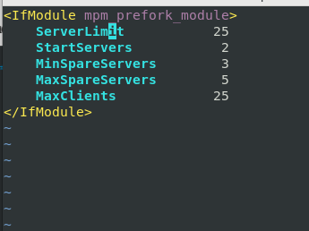
8. Show that httpd is using prefork module.
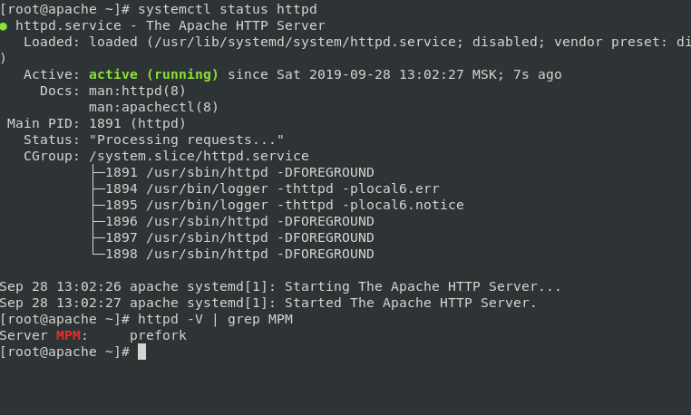
9. Using ab benchmarking tool prove that server can process only 25 simultaneous requests.
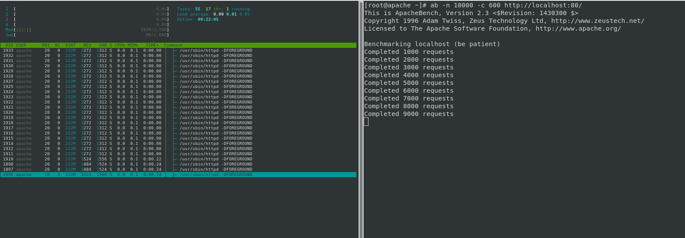
10. Show process tree, which includes workers.
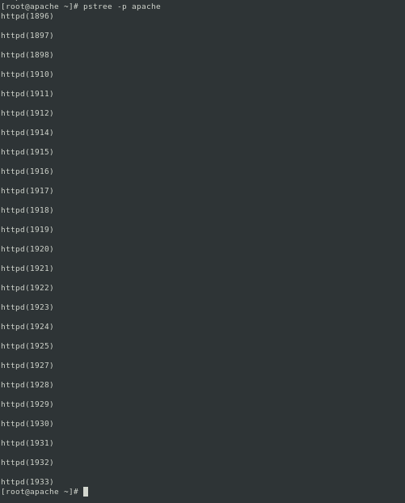
## Task 2
1. Review proxying
2. Review mod_proxy configuration
3. Configure httpd as a forward proxy with authentication. Set proxy fqdn to forward.name.surname
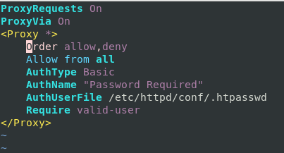
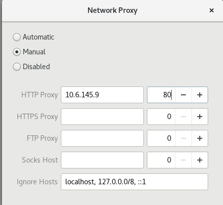
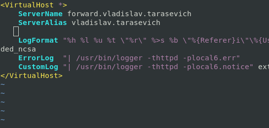
4. Grant access to internet via proxy only for user Name_Surname.
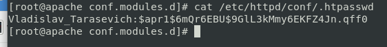
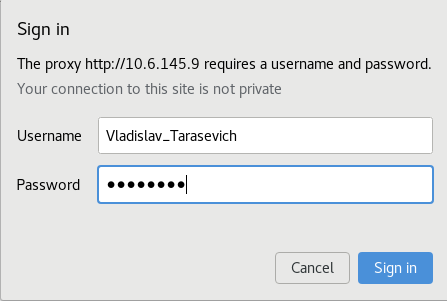
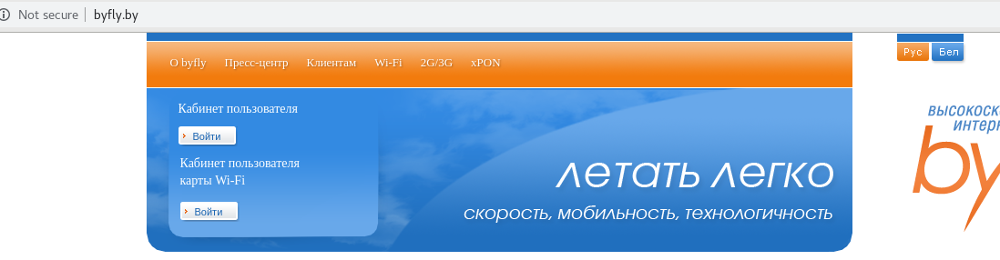
5. Configure httpd as a reverse proxy to any url of your choice. Set proxy fqdn to reverse.name.surname
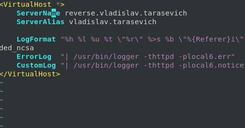
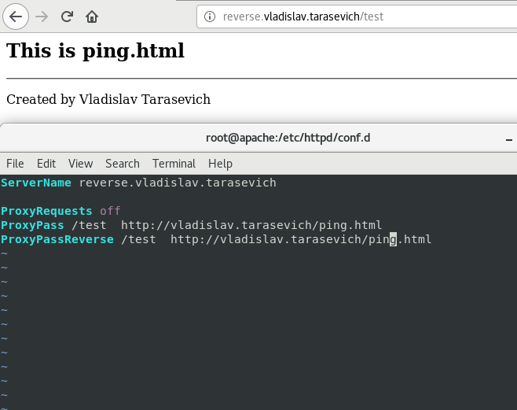
