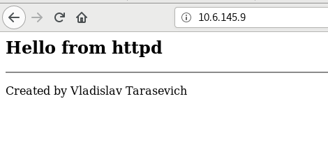
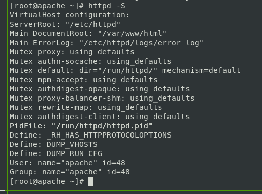
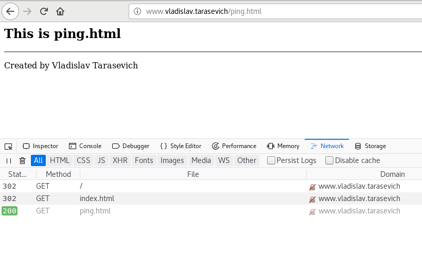

# vladislav_tarasevich_homework
## screenshot 1
a. Screenshots of test web pages being opened in browser

## screenshot 2
b. Screenshots of web server configurations used in tasks (virtual host, logging, etc.)

## screenshot 3
c. Screenshots of output of web server checks, e.g. httpd -S

## screenshot 4
d.Screenshot of debug console to confirm mod_rewrite is working while opening /

## screenshot 5
e. Screenshot of debug console to confirm mod_rewrite is working while opening /index.html

## screenshot 6
f. Screenshot of debug console to confirm mod_rewrite is working while opening /none-existing-page

## screenshot 7
g. Screenshot of virtual host with cronolog configuration, output of tree command showing layout of log files created by cronolog 

# screenshot 8
h. Screenshot of virtual host configuration with logging to syslog. Screenshots of syslog entries related to access/error web server logging.

##Check
1. What is apache graceful restart
The USR1 or graceful signal causes the parent process to advise the children to exit after their current request (or to exit immediately if they're not serving anything). The parent re-reads its configuration files and re-opens its log files. As each child dies off the parent replaces it with a child from the new generation of the configuration, which begins serving new requests immediately.

